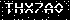

# CoePy [](https://github.com/antony-jr/CoePy/issues) [](https://github.com/antony-jr/CoePy/network) [](https://github.com/antony-jr/CoePy/stargazers) [](https://github.com/antony-jr/CoePy/blob/master/LICENSE)

This is a simple and powerful CLI tool written in python which can automate student information extraction from AU , and
eventually makes our lives better.
This script simply uses **selenium to enter form feilds** , the interesting part is that this scrip **automatically solves the
captcha generated by COE AU Website.**
Thus saves a lot of time , This can also help you if you want to check marks in **bulk** , Just execute this script , drink
your coffee and wait for the script to show your requested information.

**IMPORTANT**: Currently the script is partially tested ,(i.e cracking captcha seems to work good and entering data in the login form works good too.) but I did not scrape any information , The full login process was not tested because the COE AU Website is not responding , Thus
when it comes alive and stable I will test everything.

**NOTE**: Only tested on linux , may or may not work in other platforms.

# Installation

I did not publish this in pypi(Python Package Index) since the code will be updated frequently , and cannot release it a gazillion times ,And also **this project can be discontinued anytime.** 

Therefore you have to install it manually from source , Don't worry it will be easy. Before you do anything , Make sure you have **google chrome** or **chromium** installed in your computer. (Which will be used by this script to render the website since it
depends so much on a real browser , I will be honest , the website is very cranky when scraped with requests)

Now execute the following commands in your terminal ,
```
 $ git clone https://github.com/antony-jr/CoePy
 $ cd CoePy
 $ sudo pip3 install -r requirements.txt
 $ ./coepy.py --help
```

**Note** : This script is only tested on **Python 3.7**.

# Cracking Captcha

The most interesting part of this project is cracking the captcha generated by the website , Thats the biggest hurdle
in automating this process , right ?
So here is how I cracked it.

So first lets take a look at captcha's generated by COE AU Website ,
<p align=center>
 
 
</p>

**Note** : On observing a sample of 1500 captcha's generated by COE AU Website , the captcha seems to only follow the above two patterns.

By Observations ,   
**The Static Properties of Captcha's generated by COE AU Website are,**   


# License

The MIT License.   
Copyright (C) 2018 [Antony Jr.](https://github.com/antony-jr)
