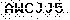

# CoePy [](https://github.com/antony-jr/CoePy/issues) [](https://github.com/antony-jr/CoePy/network) [](https://github.com/antony-jr/CoePy/stargazers) [](https://github.com/antony-jr/CoePy/blob/master/LICENSE)

This is a simple and powerful CLI tool written in python which can automate student information extraction from AU , and
eventually makes our lives better.
This script simply uses **selenium to enter form feilds** , the interesting part is that this scrip **automatically solves the
captcha generated by COE AU Website.**
Thus saves a lot of time , This can also help you if you want to check marks in **bulk** , Just execute this script , drink
your coffee and wait for the script to show your requested information.

**IMPORTANT**: Currently the script is partially tested ,(i.e cracking captcha seems to work good and entering data in the login form works good too.) but I did not scrape any information , The full login process was not tested because the COE AU Website is not responding , Thus
when it comes alive and stable I will test everything.

**NOTE**: Only tested on linux , may or may not work in other platforms.

# Installation

I did not publish this in pypi(Python Package Index) since the code will be updated frequently , and cannot release it a gazillion times ,And also **this project can be discontinued anytime.** 

Therefore you have to install it manually from source , Don't worry it will be easy. Before you do anything , Make sure you have **google chrome** or **chromium** installed in your computer. (Which will be used by this script to render the website since it
depends so much on a real browser , I will be honest , the website is very cranky when scraped with requests)

Now execute the following commands in your terminal ,
```
 $ git clone https://github.com/antony-jr/CoePy
 $ cd CoePy
 $ sudo pip3 install -r requirements.txt
 $ ./coepy.py --help
```

**Note** : This script is only tested on **Python 3.7**.

# Cracking Captcha

The most interesting part of this project is cracking the captcha generated by the website , Thats the biggest hurdle
in automating this process , right ?
So here is how I cracked it.

So first lets take a look at captcha's generated by COE AU Website ,
<p align=center>
 
 
</p>

**Note** : On observing a sample of 1500 captcha's generated by COE AU Website , the captcha seems to only follow the above two patterns.

By Observations ,   
**The Static Properties of Captcha's generated by COE AU Website are,**   

* Resolution of any arbitary captcha is always **70x20 Pixels (can be taken as 70x20 Matrix)**.
* Any arbitary captcha is always **binary** , (i.e) It will always use only black and white colours.
* Only uses **numericals 0-9** and **alphabets A-Z**
* Has very few noise.
* Any arbitary captcha has **6 characters inscribed in it**.
* A Single character can be fitted inside a **10x8 Matrix**.

Now lets do some math ,   
Let **'R'** be a matrix of a arbitary captcha image which is in **binary**.(i.e White Pixel is 255 and Black Pixel is 0) ,   
Now from the **static properties** we know that **'R' must be a 70x20 Matrix** , like so...   
<p align=center>
 
 </p>
 
Let **'C<sub>n</sub>'** be a matrix that represents a single character from the captcha , Where **'n'** represents the **n**th
character from the captcha , Thus the range of **'n'** must be **0 <= n < Number of Characters in the Captcha**.
Now from the **static properties** we know that **'C<sub>n</sub>' must be a 10x8 Matrix** , like so... 
<p align=center>
 
</p>

Let **T<sub>0</sub> T<sub>1</sub> T<sub>2</sub> ... T<sub>35</sub>** be a set of matrix which is of **order 10x8** , Let this set be the **test set**., These matrices are obtained from coverting all possible characters in the captcha's generated by COE AU Website to a matrix which
has the character in white pixels and background in black pixels , These characters are un-noised and filtered from all
samples. From the **static properties we know that the maximum number of characters is 36.**
Now these matrices are stored for later use.

Now each matrix in the set {**C<sub>0</sub> C<sub>1</sub> C<sub>2</sub> ... C<sub>5</sub>**} is compared againts each element in the **test set**. The **Percentage of Match** is calculated between a single character(**C<sub>n</sub>**) in the arbitary captcha and all the characters in the **test set** , The element in **test set** with the highest **Percentage of Match** is the most appropriate character in the position **n** of the **resultant string** which must have a length of **6**(Since the captcha has only 6 characters inscribed in it).

**T<sub>0</sub>** corresponds to the character **'0'** , **T<sub>1</sub>** corresponds to the character **'1'** , and 
thus **T<sub>m</sub>** corresponds to the character in chronological order in the list of all possible characters **'0123456789ABCDEFGHIJKLMNOPQRSTUVWXYZ'**.

The **Percentage of Match** is calculated like so... ,
<p align=center>
 
</p>

**Therefore The most appropriate character for nth character in the resultant string is obtained  , This process is repeated upto n=6(Since the maximum character inscribed in the captcha is six). Thus the resultant string is obtained.**

# License

The MIT License.   
Copyright (C) 2018 [Antony Jr.](https://github.com/antony-jr)
